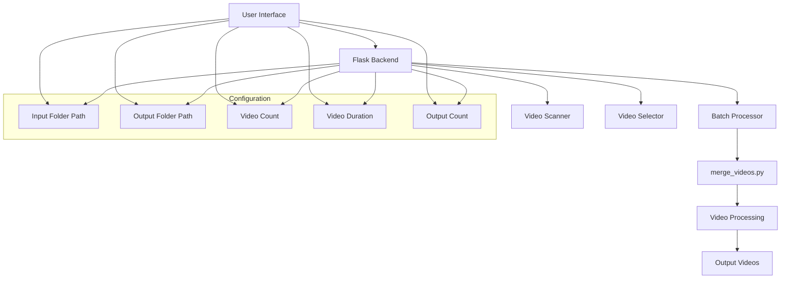
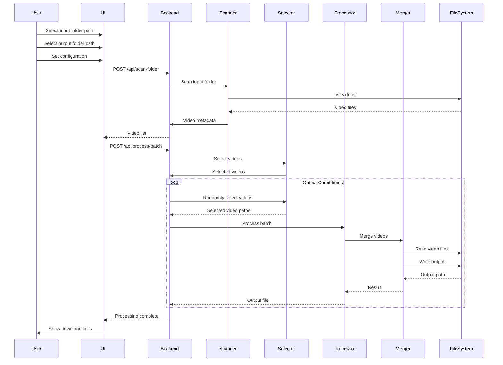
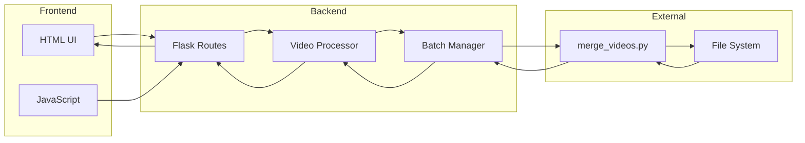
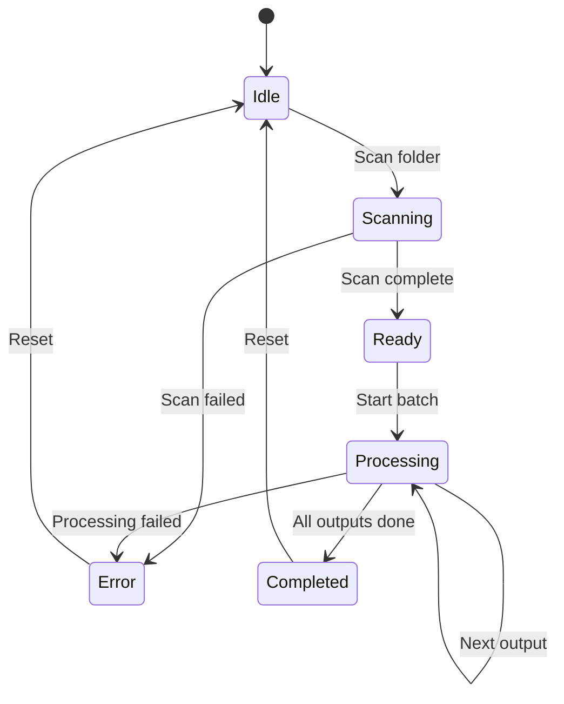
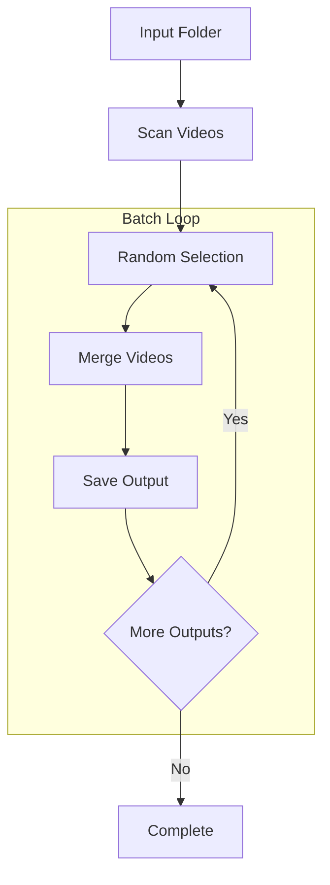

# Batch Video Creator Architecture

## System Architecture Diagram



## Data Flow Diagram



## Component Interaction



## State Management



## Video Processing Pipeline



## Error Handling Flow

```mermaid
flowchart TD
    A[Start Operation] --> B{Validate Input}
    B -->|Invalid| C[Return Error]
    B -->|Valid| D[Execute Operation]
    
    D --> E{Success?}
    E -->|Yes| F[Return Result]
    E -->|No| G{Retry?}
    G -->|Yes| D
    G -->|No| C
    
    C --> H[Log Error]
    F --> I[Update State]
    H --> J[Update State]